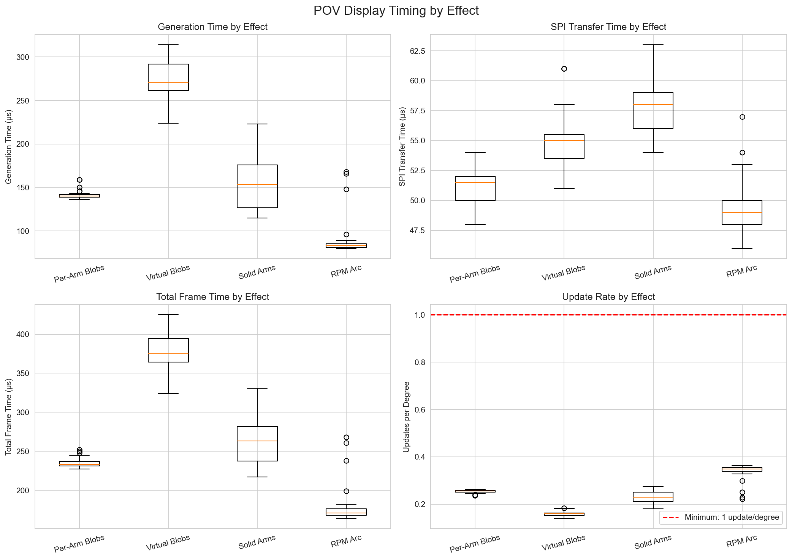

# POV Display Performance Analysis

Analysis of real-world timing data collected from ESP32-S3 POV display.

## Understanding POV Display Timing

**Critical Concept**: POV (Persistence of Vision) displays work differently than frame-based displays:

- The LEDs are physically spinning on a rotating arm
- The code runs in a tight loop, continuously updating LEDs based on current rotation angle
- There is NO hard deadline per degree - the loop just runs as fast as it can
- What matters: **How many LED updates happen per degree of rotation**

If the loop updates LEDs fast enough (≥1 update per degree), the display will look smooth.
If updates are slower (< 1 update per degree), there will be gaps/blur in the image.

## Data Summary

**Total samples:** 156
**Effects tested:** [np.int64(0), np.int64(1), np.int64(2), np.int64(3)]
**Test RPM:** 2800.1
**Revolution period:** 21428 μs
**Time per degree:** 59.5 μs

## Timing Statistics

### Overall Performance

| Component | Min | Max | Mean | Median | P95 | P99 | Std Dev |
|-----------|-----|-----|------|--------|-----|-----|---------|
| Generation | 80 | 314 | 164.4 | 141.5 | 305.5 | 313.0 | 72.4 |
| SPI Transfer | 46 | 63 | 53.4 | 53.0 | 59.2 | 61.4 | 3.9 |
| **Total** | **164** | **425** | **262.7** | **238.0** | **404.8** | **418.0** | **76.9** |

## Update Rate Analysis (Key Metric)

This is the critical metric for POV displays: **How many times do the LEDs update per degree of rotation?**

### Degrees Traveled Per Frame

- **Minimum:** 2.76° (fastest updates)
- **Maximum:** 7.14° (slowest updates)
- **Mean:** 4.41°
- **Median:** 4.00°

### Updates Per Degree

- **Minimum:** 0.14 updates/degree
- **Maximum:** 0.36 updates/degree
- **Mean:** 0.25 updates/degree
- **Median:** 0.25 updates/degree

## Per-Effect Performance

### Effect 0: Per-Arm Blobs

**Samples:** 34

| Component | Min | Max | Mean | Median | P95 | P99 |
|-----------|-----|-----|------|--------|-----|-----|
| Generation | 136 | 159 | 141.5 | 140.0 | 153.1 | 159.0 |
| SPI Transfer | 48 | 54 | 51.2 | 51.5 | - | - |
| **Total** | **227** | **252** | **234.6** | **233.0** | **248.7** | **251.3** |

**Update Rate:**
- Degrees per frame: 3.81° - 4.23° (mean: 3.94°)
- Updates per degree: 0.24 - 0.26 (mean: 0.25)

### Effect 1: Virtual Blobs

**Samples:** 39

| Component | Min | Max | Mean | Median | P95 | P99 |
|-----------|-----|-----|------|--------|-----|-----|
| Generation | 224 | 314 | 275.2 | 271.0 | 313.0 | 313.6 |
| SPI Transfer | 51 | 61 | 54.8 | 55.0 | - | - |
| **Total** | **324** | **425** | **377.1** | **375.0** | **418.0** | **422.3** |

**Update Rate:**
- Degrees per frame: 5.44° - 7.14° (mean: 6.34°)
- Updates per degree: 0.14 - 0.18 (mean: 0.16)

### Effect 2: Solid Arms Diagnostic

**Samples:** 42

| Component | Min | Max | Mean | Median | P95 | P99 |
|-----------|-----|-----|------|--------|-----|-----|
| Generation | 115 | 223 | 154.0 | 153.0 | 203.2 | 216.4 |
| SPI Transfer | 54 | 63 | 57.8 | 58.0 | - | - |
| **Total** | **217** | **331** | **261.9** | **263.0** | **310.6** | **325.3** |

**Update Rate:**
- Degrees per frame: 3.65° - 5.56° (mean: 4.40°)
- Updates per degree: 0.18 - 0.27 (mean: 0.23)

### Effect 3: RPM Arc

**Samples:** 41

| Component | Min | Max | Mean | Median | P95 | P99 |
|-----------|-----|-----|------|--------|-----|-----|
| Generation | 80 | 168 | 88.7 | 83.0 | 148.0 | 167.2 |
| SPI Transfer | 46 | 57 | 49.3 | 49.0 | - | - |
| **Total** | **164** | **268** | **177.9** | **171.0** | **238.0** | **265.2** |

**Update Rate:**
- Degrees per frame: 2.76° - 4.50° (mean: 2.99°)
- Updates per degree: 0.22 - 0.36 (mean: 0.34)

## Performance Bottleneck Analysis

### Time Breakdown (Average)

| Component | Time (μs) | Percentage |
|-----------|-----------|------------|
| Generation/Render | 164.4 | 75.5% |
| SPI Transfer | 53.4 | 24.5% |
| **Total** | **217.8** | **100%** |

**Primary bottleneck:** Generation/Render (75.5% of total time)

## Key Findings

### 1. SPI Transfer Performance

- **Mean transfer time:** 53.4 μs
- **Standard deviation:** 3.9 μs
- **Coefficient of variation:** 7.3%

✅ **Very consistent SPI timing** - excellent hardware SPI performance

### 2. Render Complexity Variance

- **Generation time range:** 80 - 314 μs
- **Variance:** 234 μs

**Effect complexity comparison:**

- Per-Arm Blobs: 141.5 μs average
- Virtual Blobs: 275.2 μs average
- Solid Arms Diagnostic: 154.0 μs average
- RPM Arc: 88.7 μs average

### 3. Update Rate Assessment

❌ **INSUFFICIENT:** Update rate too low for smooth display
- Minimum: 0.14 updates/degree
- Average: 0.25 updates/degree

Display will have visible gaps/blur. Need to optimize render time.

**Slowest effect:** Virtual Blobs (0.14 updates/degree minimum)

## RPM Range Analysis

Projecting performance across the full operating range:

| RPM | μs/degree | Worst-case frame (μs) | Degrees/frame | Updates/degree | Status |
|-----|-----------|----------------------|---------------|----------------|--------|
| 700 | 238.1 | 425 | 1.79 | 0.56 | ⚠️ Marginal |
| 1200 | 138.9 | 425 | 3.06 | 0.33 | ❌ Poor |
| 1940 | 85.9 | 425 | 4.95 | 0.20 | ❌ Poor |
| 2800 | 59.5 | 425 | 7.14 | 0.14 | ❌ Poor |

## Recommendations

### ⚠️ Optimization Recommended

Some effects fall below 1 update per degree. Consider:

1. **Optimize render code** - especially for complex effects
2. **Simplify effects** - reduce computational complexity
3. **Profile hot paths** - use timing instrumentation to identify bottlenecks

**Priority:** Optimize Virtual Blobs (mean generation time: 275.2 μs)

### SPI Performance

The SPI transfer time (53.4 μs average) is excellent and consistent.
This confirms NeoPixelBus is properly using hardware SPI at 40MHz.
No SPI optimization needed.

## Visualizations

### Timing Distributions

### Per-Effect Comparison

