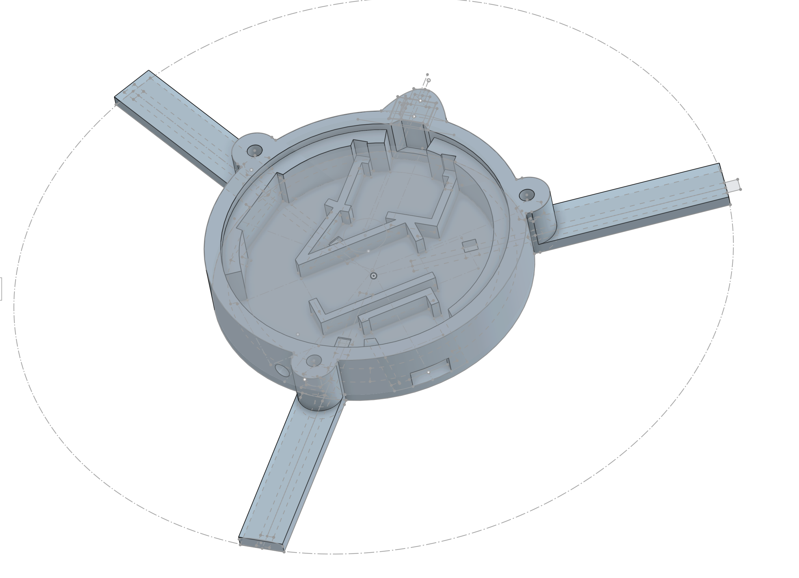
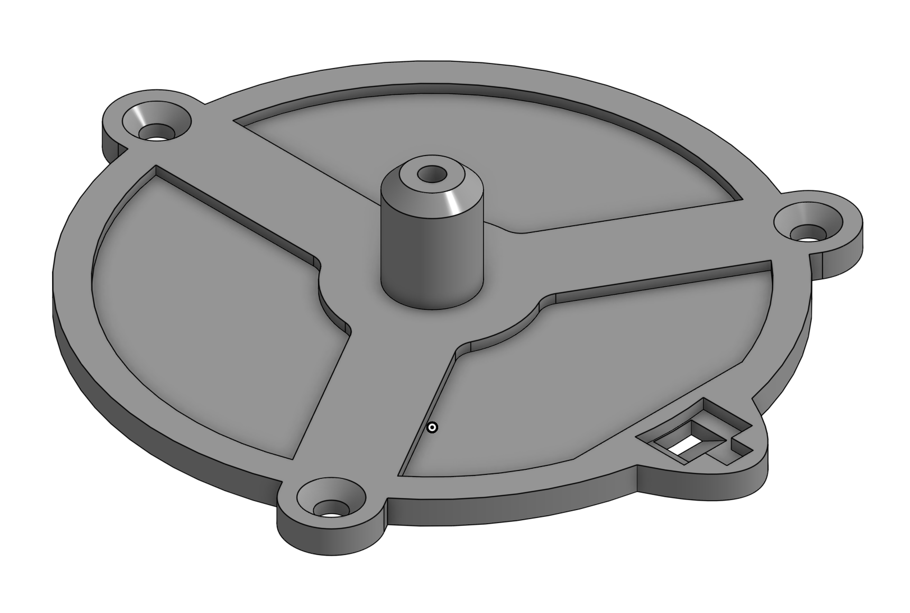

# LED Display Rotor Hardware

Physical hardware documentation for the spinning POV display rotor.

**Pin assignments:** See `led_display/include/hardware_config.h`

## Physical Assembly

**Rotation direction:** Counter-clockwise when viewed from above (looking down at LEDs). This is software-configurable via motor controller.

**Rotor mass:** 152g (fully assembled spinning mass: Rotor Base + Rotor Lid + 3 screws + grub screw)

**Arm length:** 104.5mm from center to tip

### Enclosure Structure

The rotor enclosure consists of two 3D-printed parts (Onshape naming):

- **Rotor Base** (top part): LEDs mounted on top surface; internal cavity houses electronics (ESP32, IMU, buck converter, wireless power board) mounted upside-down. Has an 84mm diameter, ~3mm deep cutout that seats the RX coil.
- **Rotor Lid** (bottom part): Flat mating surface meets the Rotor Base, capturing the coil. Shaft cylinder below accepts the motor shaft. Rectangular notch with recessed area provides clearance for the hall effect sensor mounted in the Rotor Base's protrusion.
- **Fasteners**: 3 flat-head hex screws through arm undersides; grub screw locks motor shaft in place.

**Enclosure dimensions:**
- Body radius: 46.8mm (93.6mm diameter) — the circular enclosure portion
- Arm tips: 104.5mm from center — extend beyond the body
- Coil cutout: 84mm diameter, ~3mm deep — inside the body
- **Hall sensor protrusion**: Rectangular housing extends outward from the body to position the sensor at 52mm radius (beyond the 46.8mm body edge)





```
ROTOR (spinning)
┌─────────────────────────────┐
│      ROTOR BASE (LEDs)      │  ← LEDs visible on top surface
│  ┌───────────────────────┐  │
│  │ Components mounted    │  │  ← ESP32, IMU, hall sensor, etc.
│  │ upside-down (chips    │  │     foam-taped to underside
│  │ face DOWN)            │  │
│  │                       │  │
│  │ ○ Hall sensor         │  │  ← Branded face DOWN, 52mm from center
│  │   (at coil plane)     │  │     radially outside wireless coil
│  │                       │  │
│  │ [  84mm coil cutout  ]│  │  ← ~3mm deep seat for RX coil
│  │ ═══ RX Coil ═══       │  │  ← 82mm diameter coil sits in cutout
│  └───────────────────────┘  │
│       ROTOR LID             │  ← Flat mating surface, 3 hex screws
│    ║ shaft cylinder ║       │  ← Accepts motor shaft (grub screw)
└─────────────────────────────┘
        ~6-7mm gap
┌─────────────────────────────┐
│ ═══ TX Coil ═══    ☐ Magnet │  ← Magnet at 52mm radius, S pole UP
│      ║ Motor Shaft ║        │
└──────╨─────────────╨────────┘
STATOR (stationary)
```

The hall sensor and trigger magnet are:
- At 52mm radius from rotation center
- Coplanar with the wireless coils (same horizontal level)
- Radially outside the coils (82mm diameter = 41mm radius)

### Component Positions

All angles measured counter-clockwise from hall sensor (0°), viewed from above looking down at LEDs.

| Component | Angle | Radius (mm) | Notes |
|-----------|-------|-------------|-------|
| Hall sensor | 0° | 52.0 | Reference point |
| IMU | 0° | 25.4 | Aligned with hall sensor |
| Arm 1 | 60° | 104.5 (tip) | |
| ESP32 | 140° | ~32.5 | Rough estimate |
| Arm 3 | 180° | 104.5 (tip) | |
| Buck converter | 283° | 28.2 | Center of mass |
| Arm 2 | 300° | 104.5 (tip) | |
| Wireless power board | ~0° | ~0 | Inductor coil centered on rotation axis |

### Previous Hardware Revision

For comparing telemetry data between hardware versions:

| Dimension | Previous | Current |
|-----------|----------|---------|
| Arm tip radius | 100mm | 104.5mm |
| IMU radius | 28mm | 25.4mm |
| IMU orientation | Y+ radial out, X+ tangent | X+ radial out, Y+ tangent |

## Microcontroller

- **Board**: Seeed XIAO ESP32S3
- **USB Port** (macOS): `/dev/cu.usbmodem2101`

**Why ESP32-S3?**
- Tiny form factor
- WiFi for programming/control
- Hardware SPI with DMA support

## Power System

Power is delivered wirelessly to the spinning rotor via inductive coupling.

- **Wireless power module**: Taidacent 12V 2.5A (XKT901-17)
  - 12V input/output, up to 2.5A at 5mm gap
  - TX coil: 30mm inner / 81mm outer diameter, 14µH
  - RX coil: 30mm inner / 81mm outer diameter, 14µH
  - Working distance: 5-20mm (output drops with distance)
  - Datasheet: `docs/datasheets/WirelessPower.txt`
  - **RX output cap**: 220µF electrolytic on 12V output (buffers wireless coupling latency)
- **Buck converter**: Mini MP1584EN
  - Input: 4.5-28V, Output: 0.8-20V adjustable
  - Max 3A output, 96% efficiency, 1.5MHz switching
  - Datasheet: `docs/datasheets/dc-buck-converter.txt`
  - **Input cap**: 0.1µF (104) ceramic on 12V input side (on-board or near converter)
- **Bulk capacitor**: 470µF 16V electrolytic on 5V rail output (TO BE TESTED)
  - Prevents brownouts during WiFi TX + LED current transients
  - Buffers buck converter control loop response time (~10-100µs)

### EMI from Wireless Coil

The wireless power module operates at ~60kHz, which couples into nearby wiring via electric field (capacitive coupling). Symptoms include noise on the 5V rail (~150-200mV pk-pk) and false interrupts on high-impedance signal lines.

**Mitigations implemented:**
- External pullup resistors on open-collector outputs (reduces voltage swing from coupled noise)
- Bypass caps on power lines to sensitive components
- Separating signal wires from noisy power wires (don't braid output signals with 5V)

**Potential further mitigation:**
Grounded aluminum foil between the RX coil and electronics could reduce electric field coupling. Magnetic field shielding at 60kHz requires thicker material (skin depth in aluminum ~0.34mm) and risks detuning the wireless power resonant circuit. Not implemented; current mitigations are sufficient.

## LEDs

- **Type**: HD107S (APA102-compatible, faster PWM than SK9822)
- **Quantity**: 40 logical LEDs (41 physical including level shifter at index 0)
  - Arm 1 (inside): 13 LEDs
  - Arm 2 (middle): 13 LEDs
  - Arm 3 (outer): 14 LEDs
- **Color order**: BGR
- **Configuration**: See `led_display/include/hardware_config.h` for exact layout
- **Datasheet**: `docs/datasheets/HD107S-LED-Datasheet.pdf`

**Why HD107S?**
- 4-wire clocked SPI protocol (unlike WS2812B's timing-sensitive 3-wire)
- 40MHz clock drive frequency (vs SK9822's 15MHz)
- PWM refresh rate >26kHz (vs SK9822's 4.7kHz) — reduces flicker at high rotation speeds
- APA102-compatible protocol

### LED Strip Specifications

- **LED pitch**: `LED_PITCH_MM` (7mm) — 5mm chip + 2mm gap
- **LED chip size**: `LED_CHIP_SIZE_MM` (5mm)
- **Ideal interlaced ring spacing**: `LED_PITCH_MM / 3` (2.333mm)

### LED Geometry Calibration

**Source of truth:** `led_display/include/geometry.h` → `RadialGeometry` namespace

The three LED strips create 40 interlaced concentric rings when spinning. ARM3 has 14 LEDs (extra at hub end), ARM1 and ARM2 have 13 LEDs each.

**Display boundaries (variables in geometry.h):**

| Parameter | Variable | Formula |
|-----------|----------|---------|
| Inner edge | `INNER_DISPLAY_RADIUS_MM` | `ARM3_INNER_RADIUS_MM - LED_CHIP_SIZE_MM/2` |
| Outer edge | `OUTER_DISPLAY_RADIUS_MM` | Outermost LED center + `LED_CHIP_SIZE_MM/2` |
| Inner hole Ø | `INNER_HOLE_DIAMETER_MM` | `2 × INNER_DISPLAY_RADIUS_MM` |
| Display span | `DISPLAY_SPAN_MM` | `OUTER - INNER` |

**Cartesian blind spot:** Any coordinate where `sqrt(x² + y²) < INNER_DISPLAY_RADIUS_MM` cannot be displayed.

**Why the hole matters for Cartesian→polar mapping:**

When projecting a Cartesian image onto the POV display, code converts (x, y) to polar (r, θ). The naive approach assumes the display spans from r=0 (center) to r=max (edge), but this is wrong:

```
WRONG: Assumes display goes to center
┌─────────────────────┐
│    ┌───────────┐    │  ← Image maps from center outward
│    │  center   │    │     p=0 → r=0 (center)
│    │     ●     │    │     p=max → r=OUTER (edge)
│    └───────────┘    │
└─────────────────────┘

CORRECT: Display has a hole
┌─────────────────────┐
│    ┌───────────┐    │
│    │   HOLE    │    │  ← No LEDs here! (r < INNER_DISPLAY_RADIUS_MM)
│    │  (dark)   │    │
│    │    ┌─┐    │    │     p=0 → r=INNERMOST_LED_CENTER_MM
│    │    │●│    │    │     p=max → r=OUTERMOST_LED_CENTER_MM
│    └────┴─┴────┘    │
└─────────────────────┘
```

Effects that compute `y = radius * sin(θ)` where radius ranges 0→1 will "waste" the inner portion on the blind spot. For accurate projection:

1. Use `RadialGeometry::ringRadiusMM(ring)` to get actual physical radius
2. Or offset: `physical_r = INNER_DISPLAY_RADIUS_MM + normalized_r * DISPLAY_SPAN_MM`

**Per-arm positions (variables in geometry.h):**

| Arm | Variable | Ring Assignment | Notes |
|-----|----------|-----------------|-------|
| ARM3 | `ARM3_INNER_RADIUS_MM` | Rings 0, 3, 6, 9... | Easiest to adjust |
| ARM2 | `ARM2_INNER_RADIUS_MM` | Rings 1, 4, 7, 10... | Channel constraints |
| ARM1 | `ARM1_INNER_RADIUS_MM` | Rings 2, 5, 8, 11... | Channel constraints |

**Interlacing alignment:**

LED strips were positioned by eye using grooved channels. Deviations from ideal `LED_PITCH_MM / 3` spacing create visible "lumpy" banding in radial gradients.

Run `pov calibration` to:
- See current interlacing errors
- Get adjustment recommendations
- Generate updated C++ constants for geometry.h

### Calibration Measurement Methodology

Two measurements determine LED positions. Current values are stored in `pov calibration`.

**"Strip Position" measurement (primary):**

Tip-to-inner-edge distance for each arm. This is the most reliable measurement.

```
Instrument: Digital calipers
Reference points:
  - Physical arm tip edge (caliper jaw grips 3D-printed arm)
  - Inner edge of innermost LED chip (edge closest to rotation center)

    ARM TIP                                    INNERMOST LED
        │                                           │
        ▼                                           ▼
        ┌─┐                                       ┌───┐
        │ │───────────────────────────────────────│LED│
        └─┘                                       └───┘
        |<────────── strip_position[arm] ──────────>|
```

**"Triangle" measurement (cross-validation):**

Distances between innermost LED centers, forming a triangle. Used to verify Strip Position measurements.

```
Instrument: Digital calipers with pointed tips
Reference points: Center of LED chip (black dot inside each LED)

                    ARM3 innermost
                         ●
                        / \
        triangle_13   /   \   triangle_23
                     /     \
                    /       \
                   ●─────────●
            ARM1   triangle_12   ARM2
          innermost            innermost
```

**Derivation (done by `pov calibration`):**
```
inner_edge_from_center = ARM_TIP_RADIUS - strip_position
led_center_from_center = inner_edge_from_center + LED_CHIP_SIZE / 2
```

### Updating Calibration After Adjustment

If LED strips are repositioned, retake the Strip Position measurement for each adjusted arm. Use the calibration tool to recompute all values:

```bash
# Show current calibration report
pov calibration report

# Enter new measurements interactively
pov calibration interactive
```

The tool outputs updated C++ constants for `geometry.h`.

**Manual calculation** (if needed):
```
ARM[n]_INNER_RADIUS_MM = 104.5 - measurement_3 + 2.5
```

The ring radii follow from the per-arm base positions:
- Ring `3k` (k=0,1,2...13): `ARM3_INNER + k * 7.0mm`
- Ring `3k+1` (k=0,1,2...12): `ARM2_INNER + k * 7.0mm`
- Ring `3k+2` (k=0,1,2...12): `ARM1_INNER + k * 7.0mm`

## Sensors

### Hall Effect Sensor

Detects magnet on stationary frame once per revolution for timing reference.

- **Model**: Allegro A3144 (unipolar, active-low, south-pole activated)
  - Operate point (BOP): 35-450 Gauss (output turns ON, pulls low)
  - Release point (BRP): 25-430 Gauss (output turns OFF, returns high)
  - Hysteresis: 20-80 Gauss typical
  - Supply: 4.5-24V, open-collector output
  - Note: Discontinued, A1104 is recommended substitute
  - Datasheet: `docs/datasheets/A3141-2-3-4-hall-effect-sensor-Datasheet.txt`

- **Wiring** (~100mm 30AWG silicone stranded wire to ESP32):
  - 5V and GND braided together
  - Output wire run separately (not braided with power) to reduce capacitive coupling
  - **10µF ceramic bypass cap** spliced inline on 5V/GND, closer to hall sensor (filters ~60kHz wireless coil noise)
  - **4.7kΩ external pullup** from output to 3.3V at ESP32 (stiffens the high-impedance node against capacitively-coupled noise; ESP32 internal pullup alone (~45kΩ) is insufficient)

- **No hardware glitch filter**: The ESP32-S3 lacks the configurable "flex glitch filter" (`gpio_new_flex_glitch_filter`) that exists on newer chips (ESP32-C6, H2). The ESP-IDF docs mention it but it's not available on S3 hardware. The fixed "pin glitch filter" exists but only filters ~25ns pulses (useless for µs-scale noise). Rely on analog mitigations above instead.

- **Trigger magnet** (on stator):
  - Type: 5x2mm neodymium disc (~2500-3000 Gauss at surface)
  - Air gap: ~3.5mm at closest approach
  - Radius from rotation center: 52mm

**Electrical timing** (from datasheet):

| Parameter | Typical | Maximum |
|-----------|---------|---------|
| Output fall time (tf) | 0.18μs | 2.0μs |
| Output rise time (tr) | 0.04μs | 2.0μs |

At 2800 RPM, 0.18μs = 0.003° of rotation. Electrical response is negligible.

**Trigger behavior:**

The firmware triggers on the **falling edge** (GPIO_INTR_NEGEDGE) which occurs when the magnetic field exceeds the operate threshold - i.e., when the sensor **enters** the magnet's detection zone, not when it leaves.

Due to magnetic field geometry, the sensor triggers approximately **6° before** reaching closest approach to the magnet. This creates a fixed angular offset between the ISR timestamp and the physical magnet position:

- `angle_deg = 0°` (hall timestamp) → sensor is ~6° before magnet
- `angle_deg ≈ 6°` → sensor at closest approach to magnet

For RPM calculation, this offset is irrelevant (cancels out). For correlating telemetry angles to physical positions on the rotor, subtract 6° from telemetry angles to get position relative to the magnet. See `POV_TELEMETRY_ANALYSIS_GUIDE.md` for calibration details.

### MPU-9250 IMU

9-axis IMU (gyroscope + accelerometer + magnetometer) for motion sensing.

- **Model**: InvenSense MPU-9250
- **Interface**: I2C at 400kHz (ADO=LOW for address 0x68, NCS=HIGH for I2C mode)
- **Sensors**:
  - Gyroscope: ±250/500/1000/2000 °/s, 16-bit ADC
  - Accelerometer: ±2/4/8/16g, 16-bit ADC
  - Magnetometer: ±4800µT (AK8963), 14-bit (not used)
- **Pin assignments**: See `led_display/include/hardware_config.h`
- **Datasheet**: `docs/datasheets/PS-MPU-9250A-01-v1.1.pdf`

**Mounting orientation:**

The IMU is mounted upside-down (chip facing floor), 25.4mm from rotation center. Pin header faces toward center of rotation.

| IMU Axis | Physical Direction | Notes |
|----------|-------------------|-------|
| **Z+** | DOWN (toward ground) | Aligned with gravity when stationary |
| **X+** | Radial (outward) | Saturates from centrifugal force at operating speed |
| **Y+** | Tangent, in direction of CCW rotation | Toward 90° at the 0° position |

Counter-clockwise rotation (viewed from above) means **GZ is negative** during normal operation.

**Telemetry configuration:** (see `led_display/include/Imu.h` for current settings)
- Accel range: ±16g (2048 LSB/g)
- Gyro range: ±2000°/s (16.4 LSB/°/s)
- DATA_READY interrupt for timestamping

**Raw data conversion (in Python analysis):**
- Accel: `raw * (16.0 / 32768.0)` = g
- Gyro: `raw * (2000.0 / 32768.0)` = °/s
